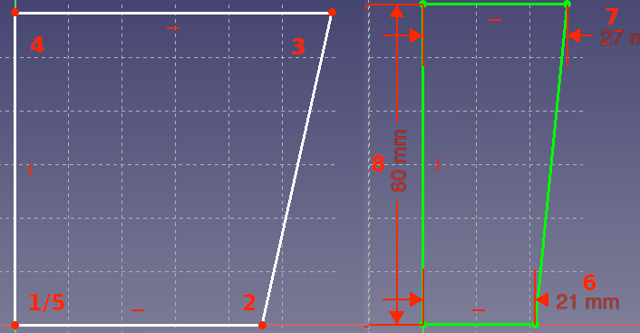

# Anleitung einfacher Mülleimer

Hier ekläre ich wie mittels des freien Programms FreeCAD https://www.freecadweb.org/ einen einfachen Mülleimer creirt werden kann.

1. Wir öffnen ein neues Projekt in FreeCAD, und wechseln in die Part Design Workbench.
     
    Dort wählen wir "Körper erstellen" 

2. Erstellen eines Skizze in der xz Ebene

3. Hier erstellen wir eine Linienzug  mit der starten wir am Nullpunkt. Gehen auf der X-Achse nach rechts, dann hoch (nicht vertikal), nach links auf die Z-Achse (horizontal) und den letzten Punkt erneut in den Nullpunkt.

4. Der nächste Schritt ist die bemaßung. Dazu nutzen wir den horizontalen und vertikalen Abstand . Den unteren Abstand stellen wir auf 21mm ein, den oberen auf 27mm, als letztes geben wir die höhe mit 60mm an.
Das Ganze sollte jetzt in etwas so aussehen:

5. Jetzt verlassen wir die Skizze 

6. Der letzte Schritt für dieses Teil ist eine Rotation , hier stimmen die Parameter bereits. Wir rotieren um die "Vertikale Skizzenachse" um 360° und klicken auf OK.

7. Jetzt fehlt nur noch ein Sichern der Datei und ein exportieren (Datei->Exportieren) als *.stl um die Datei später weiter verarbeiten zu können. *Hinweis* bei dem exportieren muss darauf geachtet werden das im Strukturbaum das Bauteil ausgewählt wurde (das Bauteil wird grün in der rechten Ansicht), sonst wird nur eine leere Datei exportiert.