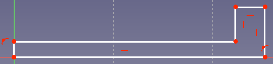
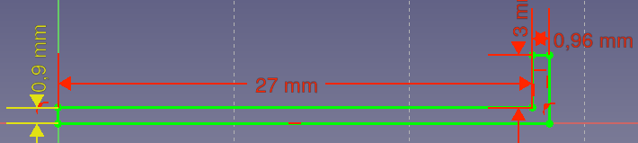

# Anleitung für den einfachen Deckel

1. Wir öffnen ein neues Projekt in FreeCAD, und wechseln in die Part Design Workbench.
     
    Dort wählen wir "Körper erstellen" 

2. Erstellen eines Skizze in der xz Ebene

3. Hier erstellen wir eine Linienzug  mit der starten wir am Nullpunkt. Folgende Form sollte erzeugt werden:

4. Der nächste Schritt ist die bemaßung. Dazu nutzen wir den horizontalen und vertikalen Abstand . Hier stellen wir die folgenden Maße ein:

Danach verlassen wir die Skizze über .

5. Jetzt nutzen wir die Rotation , hier stimmen die Parameter bereits. Wir rotieren um die "Vertikale Skizzenachse" um 360° und klicken auf OK.

6. Wer möchte kann jetzt noch Griffe an seinen Deckel konstruieren. 
Hierzu gibt es keine Anleitung, da wir die nicht zwingend brauchen und es eine gute Übung ist. Bei Fragen meldet euch gerne bei mir.